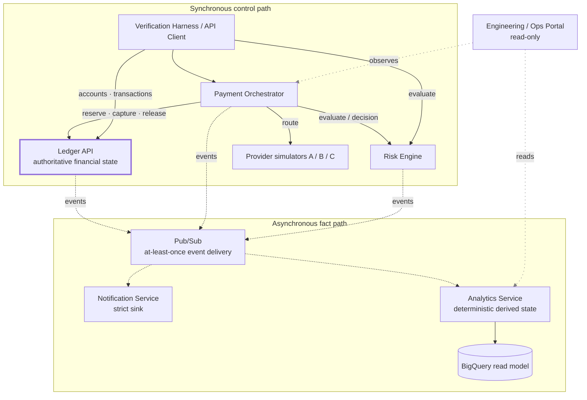
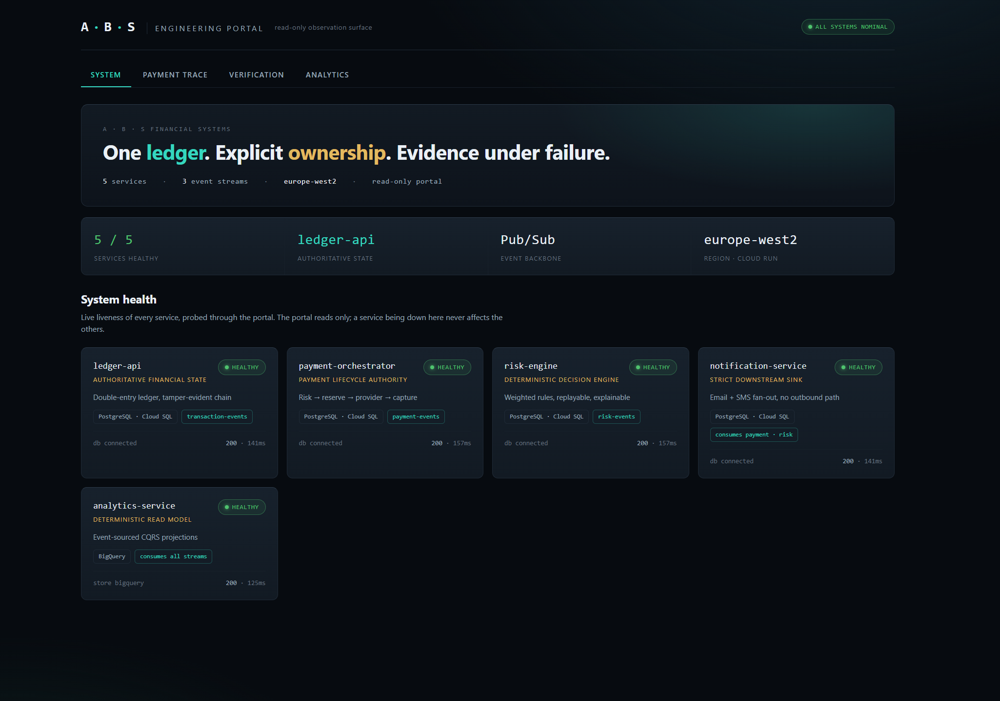
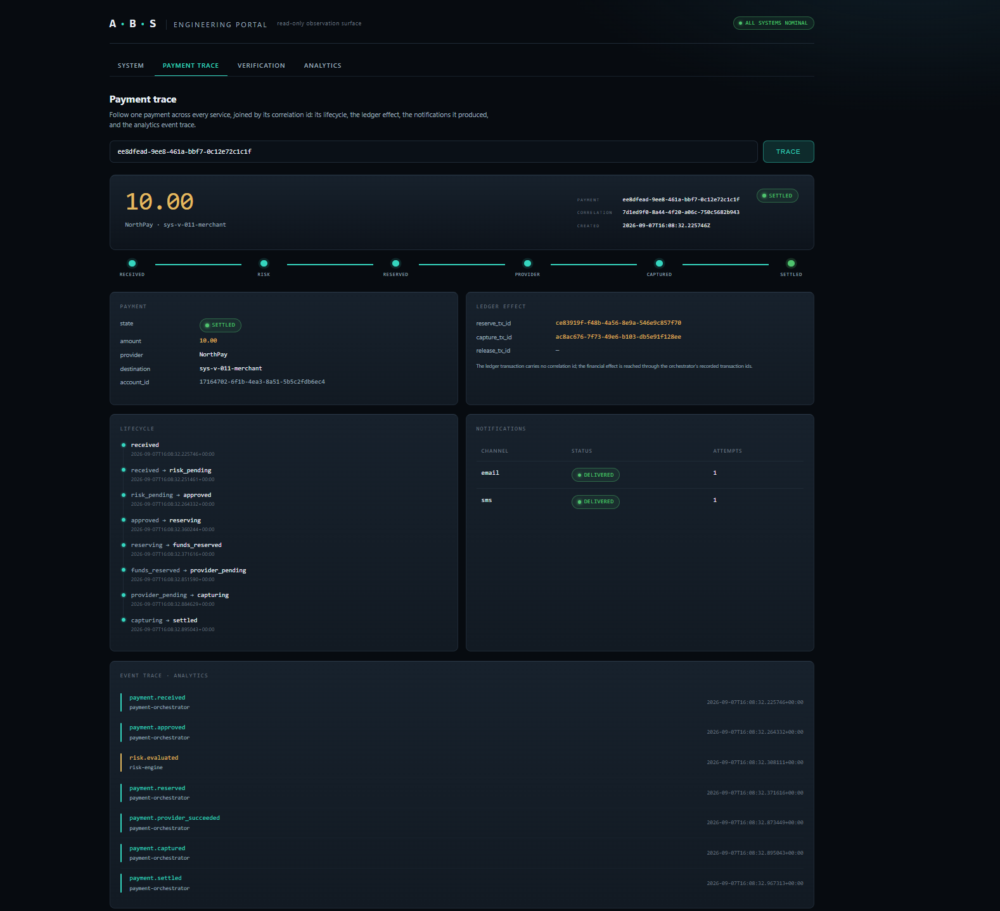
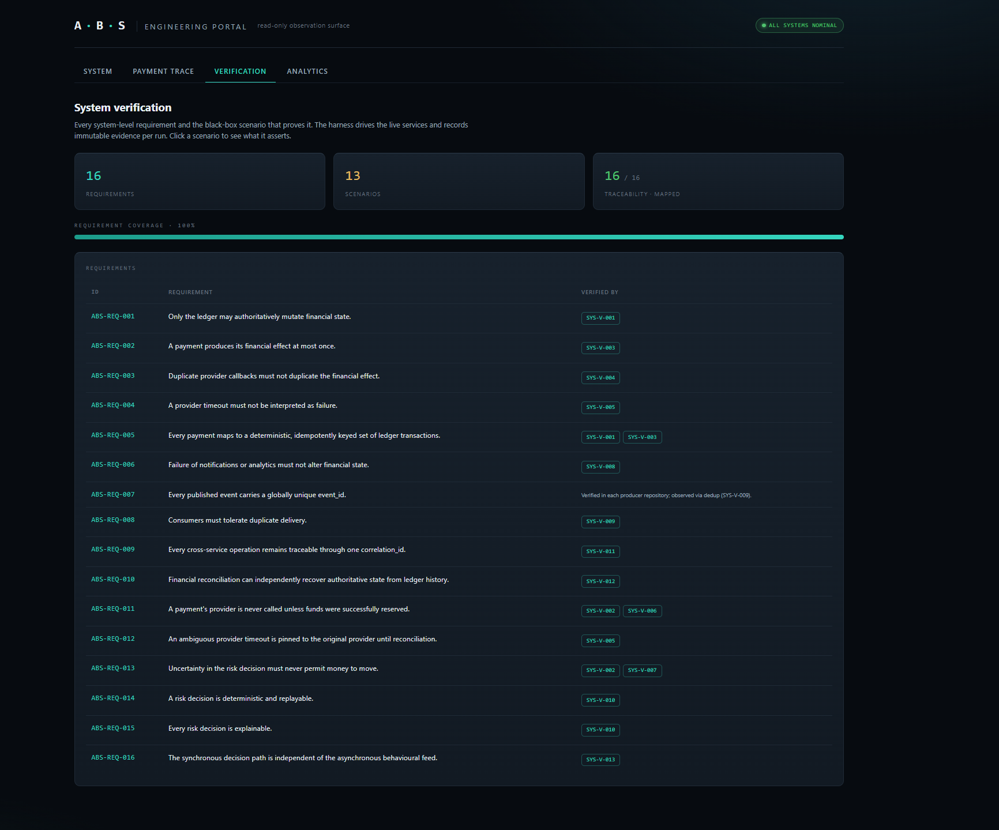
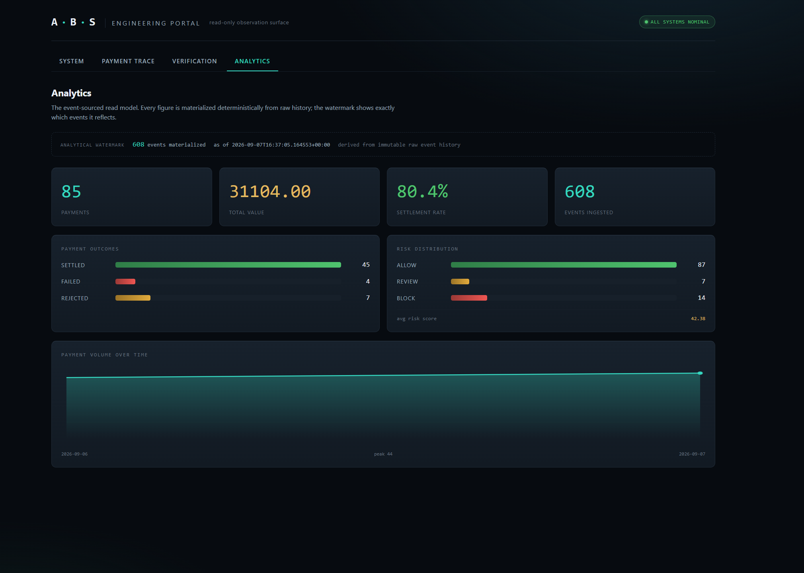

# ABS Financial Systems

Cloud-native financial infrastructure and distributed systems engineering.

A distributed financial platform built around one authoritative double-entry ledger, with payment orchestration, risk controls, event-driven services, analytics and reproducible cloud infrastructure around it. The organising idea is deliberately narrow:

> One authoritative source of financial truth. Specialised subsystems around it. Explicit contracts between them. Evidence that the whole thing behaves correctly under failure.

Everything in this ecosystem either asks the ledger to perform a financial operation, decides whether an operation should occur, consumes events describing what occurred, or presents derived information. Only one component is ever allowed to authoritatively change a balance.

This repository is the **system layer** over that ecosystem. It owns no financial, payment, risk, notification, analytics or infrastructure state of its own. It holds the cross-service contracts, the requirements that must hold between services, and the black-box verification that proves they do.

---

## The ecosystem

Line styles: a solid line is a synchronous request or control call, a dashed line is an asynchronous event, and a dotted grey line is the portal's read-only observation.

Two paths, deliberately separated. On the **synchronous control path** an API client drives the orchestrator, which calls the risk engine for a decision and the ledger to reserve, capture or release funds, and routes to a provider. On the **asynchronous fact path** the ledger, orchestrator and risk engine publish events to Pub/Sub, which fans them out to the notification and analytics sinks; analytics materialises a deterministic read model in BigQuery. The risk engine also consumes payment events on the async path to maintain its own behavioural state, independently of the synchronous decision it returns.

The ledger is the only component permitted to authoritatively mutate financial state. That boundary is non-negotiable and is enforced as a system requirement, not a convention.

---

## Subsystems

All six repositories are built, deployed, and live on Cloud Run. Each was built to the same bar: real tests, real failure evidence, no stubs presented as finished.

| Repository | Role | Status |
|------------|------|--------|
| [ledger-api](https://github.com/abdullahabduljabbarab/ledger-api) | Authoritative double-entry state and settlement engine | Live |
| [payment-orchestrator](https://github.com/abdullahabduljabbarab/payment-orchestrator) | Payment lifecycle, provider routing, compensation saga | Live |
| [risk-engine](https://github.com/abdullahabduljabbarab/risk-engine) | Deterministic, explainable risk evaluation; can block, never settles | Live |
| [notification-service](https://github.com/abdullahabduljabbarab/notification-service) | Event-driven side effects; a strict sink whose failure never touches money | Live |
| [analytics-service](https://github.com/abdullahabduljabbarab/analytics-service) | Event-sourced CQRS read model over BigQuery, separated from the financial core | Live |
| [platform-infrastructure](https://github.com/abdullahabduljabbarab/platform-infrastructure) | Shared Terraform, keyless CI federation, dedicated runtime identities, one owner per resource | Live |

The platform runs with zero long-lived CI credentials (repository-scoped OIDC federation) and every service on its own least-privilege runtime identity.

---

## What holds it together

**Authoritative state ownership.** The ledger owns balances. No other service writes to financial state; they request operations or consume the results. See [docs/ARCHITECTURE.md](docs/ARCHITECTURE.md).

**A black-box service contract.** Each service is defined by its public HTTP surface and the events it publishes, nothing more. That contract, endpoints, auth, request and response shapes, and the constraints it imposes, is written down in [docs/SERVICE_CATALOGUE.md](docs/SERVICE_CATALOGUE.md).

**A common event language.** Every service publishes and consumes events in one envelope, carrying a `correlation_id` so a single user action can be traced across services. See [docs/EVENT_CATALOGUE.md](docs/EVENT_CATALOGUE.md).

**System-level invariants.** The properties that must hold across service boundaries (a payment has at-most-once financial effect, a provider timeout is not a failure, duplicate callbacks do not duplicate settlement, uncertainty never moves money) are written as numbered requirements. See [docs/SYSTEM_REQUIREMENTS.md](docs/SYSTEM_REQUIREMENTS.md).

**Verified, not asserted.** Each requirement maps to a black-box scenario that drives the live services and produces immutable evidence. See [docs/VERIFICATION_PLAN.md](docs/VERIFICATION_PLAN.md).

**Decisions on record.** Architectural decisions are captured as ADRs in [docs/adr/](docs/adr/).

---

## This repository

The umbrella is the integration layer, not another service. It has two executable parts.

**Verification harness** ([verification/](verification/)). A black-box system verification suite: typed clients for each service built from the service catalogue, scenarios (SYS-V-*) mapped to the system requirements, and an immutable per-run evidence record. It reaches no service database or queue; it drives the deployed services exactly as any other client would.

**Engineering portal** ([`portal/`](portal/), live at [abs-portal](https://abs-portal-eppidgbmxa-nw.a.run.app)). A read-only engineering and operations surface over the live ecosystem: system health, a cross-service payment trace, the verification matrix, and risk, notification and analytics reads. One Cloud Run service serving a FastAPI BFF and a React frontend. Not a customer banking UI.

Build progress is tracked in [docs/PRODUCTION_LOG.md](docs/PRODUCTION_LOG.md).

---

## The portal

Live at [abs-portal-eppidgbmxa-nw.a.run.app](https://abs-portal-eppidgbmxa-nw.a.run.app). A read-only observation surface over the live ecosystem, all four views drive the real services through the BFF.

**System** opens with the platform's thesis, its live state, and a card per service naming what each one owns.

**Payment trace** follows one payment across every service, joined by its correlation id: its lifecycle rail, the ledger effect (the orchestrator's recorded reserve and capture transaction ids), the notification deliveries, and the analytics event trace, each event colour-railed by its producer.

**Verification** is the requirement-to-scenario matrix, every ABS-REQ mapped to the black-box scenario that proves it, with a coverage bar and per-scenario assertion drawers. **Analytics** is the event-sourced read model with its watermark, outcome and risk distributions, and volume over time.

| Verification matrix | Analytics read model |
|---|---|
|  |  |

---

## Scope discipline

This platform deliberately does not include Kubernetes, Kafka, Redis, blockchain, real card networks, SWIFT, ISO 20022, credit scoring, real customer data, or machine-learning fraud models. Every component has to answer one question before it is added: what actual engineering problem does it solve. The value is in the correctness and failure behaviour of a small number of well-defined services, not in the length of the technology list.

---

An independent engineering project by Abdullah Ameed Abduljabbar.
