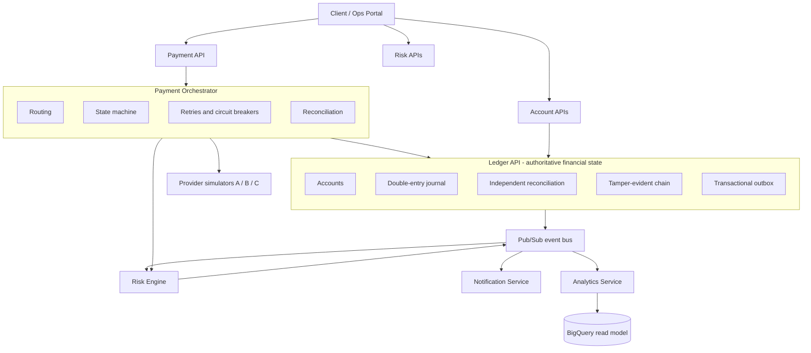

# ABS Financial Systems

Cloud-native financial infrastructure and distributed systems engineering.

A distributed financial platform built around one authoritative double-entry ledger, with payment orchestration, risk controls, event-driven services, analytics and reproducible cloud infrastructure around it. The organising idea is deliberately narrow:

> One authoritative source of financial truth. Specialised subsystems around it. Explicit contracts between them. Evidence that the whole thing behaves correctly under failure.

Everything in this ecosystem either asks the ledger to perform a financial operation, decides whether an operation should occur, consumes events describing what occurred, or presents derived information. Only one component is ever allowed to authoritatively change a balance.

---

## The ecosystem

The risk engine both decides synchronously (the orchestrator calls it) and consumes transaction events to maintain its own risk state and cases. It owns those cases internally; they are not a separate service.

The ledger is the only component permitted to authoritatively mutate financial state. That boundary is non-negotiable and is enforced as a system requirement, not a convention.

---

## Subsystems

| Repository | Role | Status |
|------------|------|--------|
| [ledger-api](https://github.com/abdullahabduljabbarab/ledger-api) | Authoritative financial state and settlement engine | Built |
| payment-orchestrator | Payment lifecycle, provider routing, exactly-once settlement | Next |
| risk-engine | Deterministic risk evaluation; can block, never settles | Planned |
| notification-service | Event-driven side effects; failure never touches money | Planned |
| analytics-service | Read model and metrics, separated from the financial core | Planned |
| platform-infrastructure | Shared Terraform, IAM, Pub/Sub, monitoring | Planned |

Each subsystem is built to the same bar as the ledger: real tests, real failure evidence, no stubs presented as finished.

---

## What holds it together

**Authoritative state ownership.** The ledger owns balances. No other service writes to financial state; they request operations or consume the results. See [ARCHITECTURE.md](ARCHITECTURE.md).

**System-level invariants.** The properties that must hold across service boundaries (a payment settles at most once, a provider timeout is not a failure, duplicate callbacks do not duplicate settlement) are written down as numbered requirements and mapped to the tests that verify them. See [SYSTEM_REQUIREMENTS.md](SYSTEM_REQUIREMENTS.md).

**A common event language.** Every service publishes and consumes events in one envelope, carrying a `correlation_id` so a single user action can be traced end to end across every service. See [EVENT_CATALOGUE.md](EVENT_CATALOGUE.md).

**Decisions on record.** Architectural decisions are captured as ADRs in [docs/adr/](docs/adr/).

---

## Build order

1. **ledger-api** (built). The authoritative core.
2. **payment-orchestrator**. The payment lifecycle and exactly-once settlement, the deepest distributed-systems problem in the platform.
3. **risk-engine**. Deterministic rules, consumes transaction events, blocks but never settles.
4. **notification-service**. Proves loose coupling: it can fail and money still moves.
5. **analytics-service**. The OLTP-versus-analytics separation.
6. **platform-infrastructure**. Consolidated Terraform, IAM, monitoring.
7. **Ecosystem portal and system verification**. Live cross-service traces and failure-injection evidence.

---

## Scope discipline

This platform deliberately does not include Kubernetes, Kafka, Redis, blockchain, real card networks, SWIFT, ISO 20022, credit scoring, real customer data, or machine-learning fraud models. Every component has to answer one question before it is added: what actual engineering problem does it solve. The value is in the correctness and failure behaviour of a small number of well-defined services, not in the length of the technology list.

---

An independent engineering project by Abdullah Ameed Abduljabbar.
