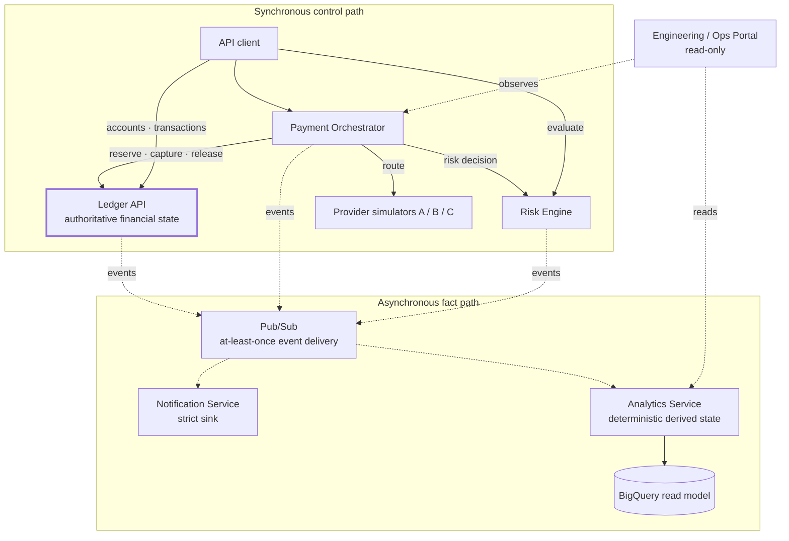

# Architecture

## The one rule

The ledger is the single authoritative owner of financial state. Every other service falls into one of four roles:

- **Requests** a financial operation (the payment orchestrator asks the ledger to reserve, capture or release).
- **Decides** whether an operation should happen (the risk engine allows or blocks).
- **Consumes** events describing what happened (notifications, analytics, risk state).
- **Presents** derived information (the portal).

No service other than the ledger writes to financial state. A balance changes only as the result of a double-entry transaction inside the ledger. This is enforced as [ABS-REQ-001](SYSTEM_REQUIREMENTS.md).

## Layers

Solid arrows are synchronous calls; dashed arrows are asynchronous events.



The orchestrator sits between a payment request and settlement. It is the only service that talks to external providers, and the only service permitted to request payment-specific reserve, capture and release operations from the ledger. Risk sits to the side of the orchestrator: it can change the decision, but it cannot change the money. It plays two roles on the two paths: it decides synchronously when the orchestrator asks, and it consumes payment events asynchronously to maintain its own behavioural account state, which informs later decisions without ever blocking one already returned.

## Payment lifecycle, end to end

A single payment moves through the platform like this, with one `correlation_id` threaded through every hop:

```
HTTP request            -> payment created, correlation_id assigned
Risk evaluation         -> allow / review / block
Reserve                 -> customer funds held in Payment Suspense
Provider request        -> success / failed / timeout (unknown)
Capture or release      -> Suspense to Settlement Clearing, or back to customer
Outbox event            -> written in the same DB transaction as the state change
Pub/Sub                 -> at-least-once delivery
Notification            -> side effect, may fail independently
Analytics               -> read model updated
```

Money moves through the ledger as a deterministic reserve followed by either a capture or a release, never a single opaque settlement. Reserving before the provider call means funds are held before any external send, so the provider is never asked to move money the customer cannot cover.

The interesting states are the ambiguous ones. A provider **timeout** does not mean the payment failed. The payment stays UNKNOWN while its reservation remains held, and reconciliation asks the provider directly whether to capture or release. Blindly retrying an unknown could move money twice, so the outcome is resolved against the provider before capture or release. This is [ABS-REQ-004](SYSTEM_REQUIREMENTS.md).

## Data ownership

Each service owns its own database. Nothing reaches across into another service's tables.

- **Ledger** owns accounts, transactions and ledger entries. It is the source of truth for balances, which are derived from entries and never stored.
- **Payment orchestrator** owns payment records and their state history.
- **Risk engine** owns its risk decisions and the rolling behavioural account state it builds from payment events.
- **Notification service** owns a delivery log.
- **Analytics** owns a read model in BigQuery, populated only from events. It never writes back into the financial core.

At portfolio scale this is one managed PostgreSQL instance with logically separate databases, plus BigQuery for analytics. Service ownership boundaries are preserved without paying for four separate instances.

## Messaging

Services communicate through Pub/Sub using the shared envelope in [EVENT_CATALOGUE.md](EVENT_CATALOGUE.md). Delivery is **at-least-once**: the same event can arrive more than once, so every consumer deduplicates on `event_id`.

Platform rule: any service that persists state and emits an event about that state uses a local transactional outbox, so the event is written in the same database transaction as the state change. An event therefore exists if and only if the change it describes committed. This applies to the orchestrator's payment transitions and the risk engine's cases, not only to the ledger's financial state, which gives the whole platform one consistent reliability model rather than a different guarantee per service.

## Traceability

Every event carries a `correlation_id` (the identifier for the originating user action) and a `causation_id` (the event or request that directly caused this one). Together they let a single payment be followed from the inbound HTTP request through risk, the provider, the ledger transaction, the outbox event, and every downstream consumer. The ecosystem portal surfaces this as a live end-to-end trace.

## Deployment

All services run on Cloud Run in `europe-west2`. Cloud SQL holds the transactional databases, Pub/Sub is the event bus, BigQuery holds the analytics read model, Secret Manager holds credentials, and Artifact Registry holds the images. The infrastructure is defined as code in the `platform-infrastructure` repository and validated in CI. CI/CD lints, tests, validates the Terraform and deploys on green.
